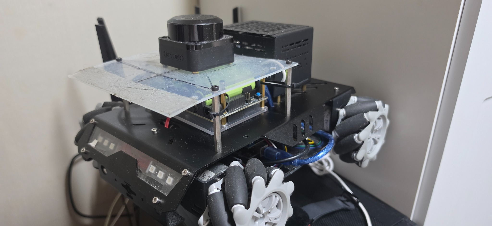
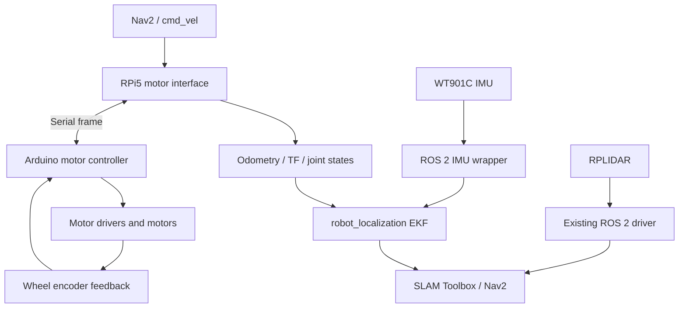
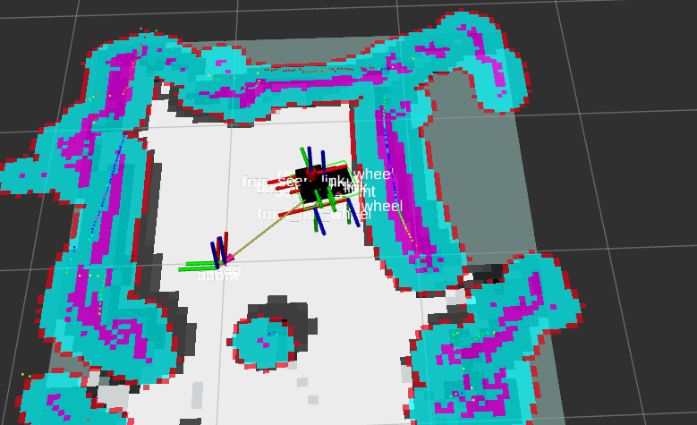
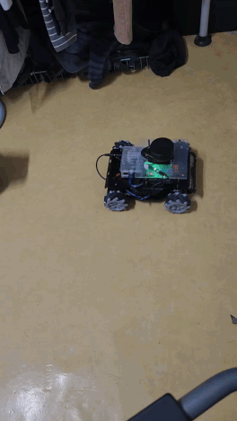

# KSS Mecanum ROS 2 Robot

Raspberry Pi 5와 Arduino 기반으로 제작한 ROS 2 매카넘 모바일 로봇 프로젝트입니다. 상용 모터·센서 하드웨어를 직접 조립하고, 하위 제어기와의 통신부터 ROS 2 인터페이스, URDF/TF, SLAM 및 Nav2까지 하나의 시스템으로 통합하여 실제 로봇의 자율주행 동작을 검증했습니다.

이 프로젝트의 중심은 SLAM이나 경로 계획 알고리즘 자체의 개발보다는, **하드웨어 인터페이스 구성과 ROS 2 래핑, 좌표계 구성, 그리고 전체 내비게이션 스택의 시스템 통합**에 있습니다.

<p align="center">
  
</p>

<p align="center">
  직접 조립하고 ROS 2 시스템을 통합한 매카넘 모바일 로봇<br>
  Mecanum mobile robot assembled and integrated with ROS 2
</p>

## 개발 환경

| 항목 | 내용 |
| --- | --- |
| 메인 컴퓨터 | Raspberry Pi 5 |
| 하위 제어기 | Arduino 기반 모터 드라이버 |
| 운영체제 | Ubuntu 24.04 |
| ROS 2 | Jazzy |
| 주요 언어 | C / C++ / Python |
| 빌드 시스템 | CMake, ament_cmake, colcon |
| 시각화·시뮬레이션 | RViz2, Gazebo Harmonic |

## 시스템 구성



## 직접 구현 및 구성한 내용

### Arduino 모터 제어

- Arduino 기반 모터 제어 코드를 실제 하드웨어 구성에 맞게 수정했습니다.
- 네 개 매카넘 휠의 속도 명령을 처리하고 엔코더 및 RPM 데이터를 반환하도록 구성했습니다.

### Raspberry Pi 5 ↔ Arduino 통신

- Raspberry Pi 5와 Arduino 사이의 UART 통신 프레임을 구성했습니다.
- 속도 명령 전송과 엔코더·RPM 응답 수신을 위한 직렬화 및 파싱 로직을 구현했습니다.
- 시리얼 포트, baud rate, timeout을 포함한 Linux 사용자 공간 모터 인터페이스를 구현했습니다.

### ROS 2 모터 인터페이스

- 모터 인터페이스를 `rclcpp` 기반 ROS 2 노드로 래핑했습니다.
- `cmd_vel`을 구독하여 매카넘 휠 명령으로 변환합니다.
- 엔코더와 RPM을 이용해 odometry를 계산하고 `odom`, `joint_states`, odom TF를 발행합니다.

> 현재 저장소의 실제 구현은 `ros2_control`의 `hardware_interface::SystemInterface` 플러그인이 아니라 독립적인 ROS 2 브리지 노드 구조입니다. `ros2_control` 예제는 인터페이스 구조를 학습하고 참고하는 데 사용했습니다.

### IMU 및 LiDAR 연동

- WT901C IMU의 제공 SDK·인터페이스 코드를 기반으로 센서 데이터를 읽고, `sensor_msgs/msg/Imu`와 `sensor_msgs/msg/MagneticField` 토픽으로 발행하도록 래핑했습니다.
- RPLIDAR는 기존 `sllidar_ros2` 드라이버를 사용해 `LaserScan` 토픽으로 연동했습니다.
- `laser_filters`로 LiDAR scan 필터 체인을 구성했습니다.
- `robot_localization` EKF를 사용해 wheel odometry와 IMU 데이터를 융합했습니다.

### Robot description 및 TF

- 로봇 본체, 네 개의 매카넘 휠, IMU, LiDAR 및 카메라 프레임을 포함하는 URDF/Xacro skeleton을 구성했습니다.
- `robot_state_publisher`, `joint_state_publisher`와 TF 연결을 설정했습니다.
- RViz2에서 로봇 모델과 좌표계 구조를 확인할 수 있도록 구성했습니다.

### SLAM 및 Navigation

- SLAM Toolbox와 Nav2를 실제 하드웨어 인터페이스에 연결했습니다.
- 매카넘 구동을 위해 DWB local planner의 x/y/회전 속도 및 가감속 파라미터를 조정했습니다.
- 실제 로봇에서 LiDAR 기반 지도 생성과 Nav2 주행 동작을 확인했습니다.

<p align="center">
  
</p>

<p align="center">
  RViz2에서 확인한 SLAM 모드 실행 결과 — 아래 실제 주행 GIF와는 별도의 실행 장면<br>
  RViz2 SLAM-mode result — captured in a separate session from the driving GIF below
</p>

## 주요 패키지

| 경로 | 역할 |
| --- | --- |
| `mecanum_bringup` | 실제 로봇, RViz2, Gazebo 및 SLAM 실행 구성 |
| `mecanum_hardwares/.../arduino_motor_driver_ros2_jazzy` | Arduino 통신, 매카넘 구동, odometry 및 ROS 2 토픽/TF 래핑 |
| `mecanum_hardwares/.../wt90c1c` | WT901C IMU 인터페이스 및 ROS 2 토픽 발행 |
| `mecanum_hardwares/.../scan_filter` | LiDAR scan 필터 설정 |
| `mecanum_hardwares/.../ekf` | `robot_localization` EKF 설정 |
| `mecanum_frame/.../mecanum_description` | URDF/Xacro, mesh, TF skeleton 및 RViz 설정 |
| `mecanum_frame/.../mecanum_gazebo` | Gazebo Harmonic world 및 ROS-Gazebo bridge 설정 |
| `mecanum_navigation/packages` | SLAM Toolbox, Nav2, map 및 navigation 파라미터 |

## 주요 라이브러리 및 ROS 2 패키지

포트폴리오 README에는 사용한 모든 전이 의존성보다, 프로젝트 구조를 설명하는 핵심 패키지만 적는 것이 좋습니다.

- ROS 2 Jazzy: `rclcpp`, `geometry_msgs`, `nav_msgs`, `sensor_msgs`
- Control and transforms: `tf2`, `tf2_ros`, `robot_state_publisher`, `joint_state_publisher`
- State estimation: `robot_localization`
- Mapping and navigation: `slam_toolbox`, `nav2_bringup`, DWB local planner
- LiDAR: `sllidar_ros2`, `laser_filters`
- Robot model: `urdf`, `xacro`
- Visualization and simulation: `rviz2`, `ros_gz`, Gazebo Harmonic
- Build: `ament_cmake`, `colcon`

## 실행 파일

워크스페이스를 빌드하고 환경을 source한 뒤 실행합니다.

```bash
colcon build --symlink-install
source install/setup.bash
```

### 실제 로봇 SLAM 모드

모터, IMU, LiDAR, scan filter, EKF, SLAM Toolbox 및 Nav2를 함께 실행합니다.

```bash
ros2 launch mecanum_bringup mecanum.slam.launch.py
```

### RViz2 및 Gazebo 모델 확인

URDF/TF skeleton과 로봇 모델을 확인합니다. 현재 launch 파일은 RViz2와 함께 Gazebo, ROS-Gazebo bridge 및 robot spawn도 실행합니다.

```bash
ros2 launch mecanum_bringup view_mecanum.launch.py
```

### 하드웨어·RViz 테스트

파일명은 `mecanum.gazebo.launch.py`이지만, 현재 코드에서는 LiDAR, static TF, robot state publisher 및 RViz2를 실행하며 Gazebo 프로세스 자체는 포함하지 않습니다.

```bash
ros2 launch mecanum_bringup mecanum.gazebo.launch.py
```

## Localization 모드 상태

`mecanum_navigation/packages`에는 AMCL 및 SLAM Toolbox localization용 예제 launch/config 파일이 포함되어 있습니다. 그러나 현재 실제 로봇용 최상위 `mecanum_bringup`에는 저장된 지도를 불러오는 localization 전용 실행 모드가 별도로 통합되어 있지 않으며, 실제 검증 범위는 `mecanum.slam.launch.py`를 통한 SLAM 모드입니다.

## 검증 결과

<p align="center">
  
</p>

<p align="center">
  SLAM 모드에서 실제 매카넘 로봇 주행 검증<br>
  Physical mecanum robot driving validation in SLAM mode
</p>

- 상용 하드웨어를 조립해 Raspberry Pi 5, Arduino, 모터, IMU 및 LiDAR 시스템을 구성했습니다.
- 실제 로봇에서 UART 기반 모터 명령 및 encoder/RPM feedback을 확인했습니다.
- ROS 2 토픽, odometry 및 TF 연결을 확인했습니다.
- SLAM 모드에서 실제 지도 생성과 매카넘 로봇의 Nav2 주행을 확인했습니다.

## 다음 목표 — v1.1

현재 버전에서 실제 로봇의 SLAM 주행까지 확인했으며, v1.1에서는 위치 추정 구조를 정리하고 정확도를 개선하는 데 초점을 둡니다.

- 매카넘 휠의 encoder 데이터를 사용하는 wheel odometry 계산 구조를 정리합니다.
- IMU의 yaw 및 angular velocity(gyro) 데이터를 위치 추정에 사용합니다.
- encoder odometry와 IMU를 융합하는 데이터 흐름, 좌표계 및 오차 모델을 설계합니다.
- 자체 EKF 기반 state estimation을 구현하거나 `robot_localization`과 구조 및 결과를 비교합니다.
- `/odom`, `/tf`, `/robot_pose`의 추정값과 발행 구조를 개선합니다.

> 기존 버전에도 `robot_localization` 설정과 wheel odometry–IMU 연동이 포함되어 있습니다. v1.1의 목표는 이 구성을 기준으로 입력 데이터와 좌표계를 다시 검토하고, 자체 EKF 구현 가능성 및 추정 결과를 비교·검증하는 것입니다.

## 프로젝트 범위와 한계

- LiDAR 드라이버, SLAM Toolbox 및 Nav2 알고리즘 자체를 개발한 것은 아니며 기존 ROS 2 패키지를 사용했습니다.
- WT901C IMU 인터페이스는 제공 SDK 코드를 기반으로 ROS 2 메시지 형태로 래핑했습니다.
- 모터 제어부는 상용 하드웨어와 Arduino 기반 코드를 실제 시스템에 맞게 수정하여 사용했습니다.
- robot description은 전체 기구 모델의 정밀 설계보다는 센서·구동부의 TF 연결과 시스템 구동에 필요한 skeleton 구성에 초점을 두었습니다.
- 저장된 지도를 사용하는 실제 로봇 localization 전용 bringup은 별도로 완성하지 않았습니다.
- 프로젝트의 핵심 성과는 개별 알고리즘 구현보다 하드웨어 인터페이스, 통신, ROS 2 래핑, TF 및 전체 navigation stack의 통합입니다.

---

# KSS Mecanum ROS 2 Robot

This project is a ROS 2 mecanum mobile robot built around a Raspberry Pi 5 and an Arduino-based motor controller. Commercial motor and sensor hardware was assembled and integrated from the low-level communication layer through ROS 2 interfaces, URDF/TF, SLAM, and Nav2. The complete system was validated on the physical robot.

The main focus is **hardware interfacing, ROS 2 wrapping, coordinate-frame configuration, and system-level navigation integration**, rather than implementing SLAM or path-planning algorithms from scratch.

## Development Environment

| Item | Details |
| --- | --- |
| Main computer | Raspberry Pi 5 |
| Low-level controller | Arduino-based motor controller |
| Operating system | Ubuntu 24.04 |
| ROS 2 distribution | Jazzy |
| Main languages | C / C++ / Python |
| Build system | CMake, ament_cmake, colcon |
| Visualization / simulation | RViz2, Gazebo Harmonic |

## System Architecture


## Implemented and Integrated Work

### Arduino motor control

- Modified Arduino-based motor-control code for the physical hardware configuration.
- Configured four mecanum-wheel speed commands and encoder/RPM feedback.

### Raspberry Pi 5 ↔ Arduino communication

- Defined the UART communication framing between the Raspberry Pi 5 and Arduino.
- Implemented serialization and parsing for velocity commands and encoder/RPM responses.
- Implemented a Linux user-space motor interface with serial-port, baud-rate, and timeout handling.

### ROS 2 motor interface

- Wrapped the motor interface as an `rclcpp` ROS 2 node.
- Subscribes to `cmd_vel` and converts body velocity commands into mecanum-wheel commands.
- Calculates odometry from encoder and RPM data and publishes `odom`, `joint_states`, and the odom TF.

> The current repository implements this integration as a standalone ROS 2 bridge node, not as a `ros2_control` `hardware_interface::SystemInterface` plugin. `ros2_control` examples were used as learning and architectural references.

### IMU and LiDAR integration

- Wrapped the provided WT901C SDK/interface code and publishes `sensor_msgs/msg/Imu` and `sensor_msgs/msg/MagneticField` topics.
- Integrated RPLIDAR through the existing `sllidar_ros2` driver and publishes `LaserScan` data.
- Configured a `laser_filters` scan filter chain.
- Fused wheel odometry and IMU data through the `robot_localization` EKF.

### Robot description and TF

- Built a URDF/Xacro skeleton containing the base, four mecanum wheels, IMU, LiDAR, and camera frames.
- Configured `robot_state_publisher`, `joint_state_publisher`, and the TF tree.
- Added RViz2 configurations for inspecting the robot model and coordinate frames.

### SLAM and navigation

- Connected SLAM Toolbox and Nav2 to the physical hardware interfaces.
- Tuned DWB local-planner x/y/angular velocity and acceleration parameters for mecanum motion.
- Verified LiDAR-based mapping and Nav2 motion on the physical robot.

## Main Packages

| Path | Purpose |
| --- | --- |
| `mecanum_bringup` | Launch configuration for the physical robot, RViz2, Gazebo, and SLAM |
| `mecanum_hardwares/.../arduino_motor_driver_ros2_jazzy` | Arduino communication, mecanum drive, odometry, and ROS 2 topic/TF wrapper |
| `mecanum_hardwares/.../wt90c1c` | WT901C IMU interface and ROS 2 topic publisher |
| `mecanum_hardwares/.../scan_filter` | LiDAR scan-filter configuration |
| `mecanum_hardwares/.../ekf` | `robot_localization` EKF configuration |
| `mecanum_frame/.../mecanum_description` | URDF/Xacro, meshes, TF skeleton, and RViz configuration |
| `mecanum_frame/.../mecanum_gazebo` | Gazebo Harmonic worlds and ROS-Gazebo bridge configuration |
| `mecanum_navigation/packages` | SLAM Toolbox, Nav2, map, and navigation parameters |

## Key Libraries and ROS 2 Packages

For a portfolio README, listing the key packages that explain the system architecture is more useful than enumerating every transitive dependency.

- ROS 2 Jazzy: `rclcpp`, `geometry_msgs`, `nav_msgs`, `sensor_msgs`
- Control and transforms: `tf2`, `tf2_ros`, `robot_state_publisher`, `joint_state_publisher`
- State estimation: `robot_localization`
- Mapping and navigation: `slam_toolbox`, `nav2_bringup`, DWB local planner
- LiDAR: `sllidar_ros2`, `laser_filters`
- Robot model: `urdf`, `xacro`
- Visualization and simulation: `rviz2`, `ros_gz`, Gazebo Harmonic
- Build: `ament_cmake`, `colcon`

## Launch Files

Build and source the workspace before launching the packages.

```bash
colcon build --symlink-install
source install/setup.bash
```

### Physical robot SLAM mode

Starts the motor, IMU, LiDAR, scan filter, EKF, SLAM Toolbox, and Nav2 integration.

```bash
ros2 launch mecanum_bringup mecanum.slam.launch.py
```

### RViz2 and Gazebo model view

Displays the URDF/TF skeleton and robot model. The current launch file also starts Gazebo, the ROS-Gazebo bridge, and robot spawning together with RViz2.

```bash
ros2 launch mecanum_bringup view_mecanum.launch.py
```

### Hardware and RViz test

Despite its filename, the current `mecanum.gazebo.launch.py` starts the LiDAR, static TF, robot state publisher, and RViz2; it does not currently start the Gazebo process itself.

```bash
ros2 launch mecanum_bringup mecanum.gazebo.launch.py
```

## Localization Mode Status

The `mecanum_navigation/packages` directory contains example launch and configuration files for AMCL and SLAM Toolbox localization. However, a localization-only mode that loads a saved map is not integrated into the physical robot's top-level `mecanum_bringup`. The verified physical-robot workflow is the SLAM mode started through `mecanum.slam.launch.py`.

## Validation Results

- Assembled the Raspberry Pi 5, Arduino, motors, IMU, and LiDAR into a working physical system.
- Verified UART motor commands and encoder/RPM feedback on the robot.
- Verified ROS 2 topics, odometry, and TF connectivity.
- Verified real-world map generation and mecanum robot motion with Nav2 in SLAM mode.

## Next Goals — v1.1

The current version has been validated through real-robot SLAM operation. Version 1.1 will focus on organizing the state-estimation architecture and improving pose accuracy.

- Refine the wheel-odometry calculation based on mecanum-wheel encoder data.
- Use IMU yaw and angular-velocity (gyro) data in pose estimation.
- Design the data flow, coordinate frames, and error model for fusing encoder odometry with IMU measurements.
- Implement an EKF-based state estimator or compare a custom EKF with `robot_localization` in terms of architecture and estimation results.
- Improve the estimated values and publication structure of `/odom`, `/tf`, and `/robot_pose`.

> The current version already contains `robot_localization` configuration and wheel-odometry/IMU integration. The v1.1 goal is to review its input data and coordinate frames, investigate a custom EKF implementation, and compare and validate the resulting estimates.

## Scope and Limitations

- The LiDAR driver, SLAM Toolbox, and Nav2 algorithms were not implemented from scratch; existing ROS 2 packages were integrated.
- The WT901C IMU interface was wrapped into ROS 2 messages using the vendor-provided SDK code as its base.
- The motor-control layer uses commercial hardware and modified Arduino-based firmware.
- The robot description focuses on the TF skeleton required for sensor, drive, and navigation integration rather than a fully detailed mechanical model.
- A localization-only bringup for the physical robot using a previously saved map was not completed.
- The project's primary contribution is system integration across hardware interfaces, communication, ROS 2 wrappers, TF, and the complete navigation stack.
