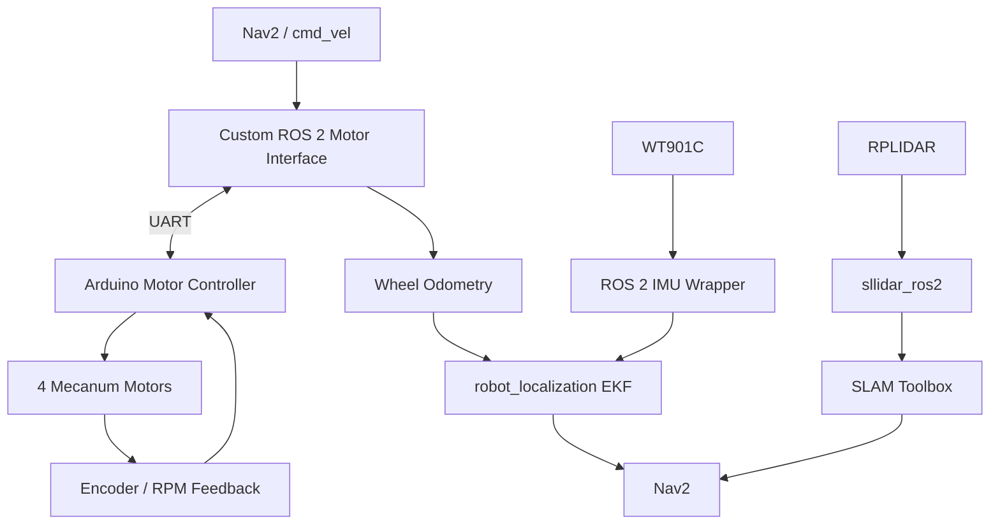

# KSS Mecanum ROS 2 Robot

Raspberry Pi 5와 Arduino 기반으로 제작한 ROS 2 매카넘 모바일 로봇 프로젝트입니다.  
상용 모터·센서 하드웨어를 조립하고, **하위 장치 통신과 ROS 2 인터페이스를 직접 구성한 뒤 기존 ROS 2 패키지와 연결하여 실제 SLAM/Nav2 주행까지 통합 검증**했습니다.

이 프로젝트의 핵심은 SLAM이나 경로 계획 알고리즘 자체를 개발하는 것이 아니라, **실제 하드웨어 인터페이스와 ROS 2 시스템을 연결하고 전체 주행 시스템을 동작시키는 것**입니다.

<p align="center">
  
</p>

## 개발 환경

| 항목 | 내용 |
| --- | --- |
| 메인 컴퓨터 | Raspberry Pi 5 |
| 하위 제어기 | Arduino 기반 모터 컨트롤러 |
| 운영체제 | Ubuntu 24.04 |
| ROS 2 | Jazzy |
| 주요 언어 | C / C++ / Python |
| 빌드 | CMake, ament_cmake, colcon |
| 주요 센서 | WT901C IMU, RPLIDAR |

## 시스템 구조



## 구현 범위

### 직접 구현

#### Raspberry Pi 5 ↔ Arduino motor interface

- Linux UART 통신 인터페이스 구현
- 모터 명령 및 encoder/RPM 응답을 위한 command/response frame 처리
- serial port, baud rate, timeout 처리
- 수신 데이터 parsing 및 모터 상태 데이터 관리

#### ROS 2 motor node

- `rclcpp` 기반 독립 ROS 2 node 구현
- `cmd_vel` subscriber 구현
- 매카넘 기구학을 이용해 `vx`, `vy`, `wz`를 4개 wheel command로 변환
- Arduino로 모터 속도 명령 전송
- encoder/RPM feedback 수신
- wheel odometry 계산
- `odom`, `joint_states` 및 TF 관련 데이터 발행

현재 구현은 `ros2_control::hardware_interface::SystemInterface` plugin이 아니라, 직접 작성한 독립 ROS 2 bridge node 구조입니다.

#### 실제 로봇 통합

- Raspberry Pi 5, Arduino, 4-wheel mecanum base, IMU, LiDAR 연결
- 각 ROS 2 node와 TF 구조 통합
- SLAM 및 Nav2가 실제 hardware interface의 데이터를 사용할 수 있도록 bringup 구성
- 실제 로봇에서 mapping 및 navigation 주행 검증

### 기존 코드 기반 수정 / 래핑

#### WT901C IMU

- vendor SDK/interface 코드를 기반으로 센서 통신 구성
- IMU 데이터를 ROS 2 `sensor_msgs/msg/Imu` 및 `sensor_msgs/msg/MagneticField` 형태로 발행
- 실제 로봇 좌표계에 맞게 ROS 2 시스템에 연동

#### Arduino motor controller

실제 하드웨어에 맞춰 Arduino 기반 모터 제어 코드를 수정하여 사용했습니다.  
이 저장소에는 Raspberry Pi 측 ROS 2/Linux motor interface가 포함되어 있으며, Arduino firmware 전체 소스는 포함되어 있지 않습니다.

### 기존 ROS 2 패키지를 사용한 범위

다음 기능은 알고리즘 자체를 새로 구현한 것이 아니라 기존 ROS 2 package를 설정·연동했습니다.

- LiDAR: `sllidar_ros2`
- scan filtering: `laser_filters`
- state estimation: `robot_localization`
- mapping: `slam_toolbox`
- navigation: `Nav2`
- local planner: DWB
- robot description / TF: URDF, Xacro, `robot_state_publisher`
- visualization: RViz2
- simulation-related configuration: Gazebo Harmonic / `ros_gz`

Nav2에서는 매카넘 구동에 맞게 x/y/angular velocity 및 acceleration 관련 parameter를 조정했습니다.

## 주요 패키지

| 경로 | 역할 |
| --- | --- |
| `mecanum_bringup` | 실제 로봇의 motor, IMU, LiDAR, EKF, SLAM/Nav2 실행 구성 |
| `mecanum_hardwares/.../arduino_motor_driver_ros2_jazzy` | UART motor interface, mecanum kinematics, odometry 및 ROS 2 wrapping |
| `mecanum_hardwares/.../wt90c1c` | WT901C vendor interface 기반 ROS 2 IMU wrapper |
| `mecanum_hardwares/.../scan_filter` | LiDAR scan filter 설정 |
| `mecanum_hardwares/.../ekf` | `robot_localization` EKF 설정 |
| `mecanum_hardwares/.../kssekf` | 자체 EKF 실험 코드 |
| `mecanum_frame/.../mecanum_description` | URDF/Xacro, mesh, TF 및 RViz 설정 |
| `mecanum_navigation/packages` | SLAM Toolbox, Nav2, map 및 navigation 설정 |

## State Estimation

실제 로봇 SLAM/Nav2 bringup에서는 `robot_localization`의 EKF를 사용했습니다.

wheel odometry와 IMU 데이터를 입력으로 사용해 ROS 2 navigation stack에 필요한 odometry/TF를 구성했습니다.

저장소에는 별도로 `kssekf` 패키지에 자체 EKF 구현 실험 코드도 포함되어 있습니다.  
이 코드는 odometry와 IMU 데이터를 이용한 predict/update 구조를 직접 구현해 보기 위한 것으로, **현재 실제 주행 검증의 기준 구성은 `robot_localization`입니다.**

따라서:

- `robot_localization`: 실제 SLAM/Nav2 주행에 사용·검증
- `kssekf`: 자체 상태추정 구조 구현 및 실험

으로 범위를 구분합니다.

## Robot Description / TF

- base와 4개의 mecanum wheel frame 구성
- IMU, LiDAR, camera frame 연결
- URDF/Xacro와 `robot_state_publisher`를 이용한 TF tree 구성
- RViz2에서 robot model과 coordinate frame 확인

Robot description은 정밀 기구 모델 제작 자체보다, 센서·구동부와 navigation stack 연결에 필요한 좌표계 구성에 초점을 두었습니다.

## SLAM / Navigation 검증

실제 로봇에서는 다음 경로를 검증했습니다.

```text
Motor / Encoder + IMU + LiDAR
        ↓
Wheel Odometry / robot_localization
        ↓
SLAM Toolbox
        ↓
Nav2
        ↓
cmd_vel
        ↓
Custom Motor Interface
        ↓
Arduino / Motors
```

<p align="center">
  
</p>

<p align="center">RViz2에서 확인한 SLAM 실행 결과</p>

<p align="center">
  
</p>

<p align="center">실제 매카넘 로봇 SLAM/Nav2 주행 검증</p>

확인한 범위:

- UART 기반 motor command / encoder / RPM feedback
- `cmd_vel` 기반 mecanum wheel command
- wheel odometry
- ROS 2 topic 및 TF 연결
- IMU와 wheel odometry의 `robot_localization` 입력
- LiDAR 기반 mapping
- Nav2 기반 실제 mecanum 주행

## 실행

워크스페이스를 빌드하고 환경을 source합니다.

```bash
colcon build --symlink-install
source install/setup.bash
```

### 실제 로봇 SLAM / Navigation

```bash
ros2 launch mecanum_bringup mecanum.slam.launch.py
```

현재 이 bringup은 motor interface, IMU, RPLIDAR, scan filter, `robot_localization`, SLAM/Nav2 구성을 함께 실행합니다.

### Robot model / RViz / Gazebo configuration

```bash
ros2 launch mecanum_bringup view_mecanum.launch.py
```

## 저장소 범위와 한계

- SLAM Toolbox, Nav2, DWB, `robot_localization` 알고리즘 자체를 구현한 프로젝트는 아닙니다.
- LiDAR는 기존 ROS 2 driver를 사용했습니다.
- WT901C는 vendor SDK/interface를 기반으로 ROS 2 wrapper를 구성했습니다.
- Arduino firmware 전체 소스는 이 저장소에 포함되어 있지 않습니다.
- 저장소에는 localization 관련 launch/config와 자체 EKF 실험 코드가 포함되어 있지만, 실제 주행 검증의 기준은 `mecanum.slam.launch.py`를 이용한 SLAM/Nav2 구성입니다.
- 프로젝트의 핵심 범위는 **하드웨어 통신, ROS 2 interface, odometry, TF, 센서 통합과 navigation stack의 실제 시스템 통합**입니다.
